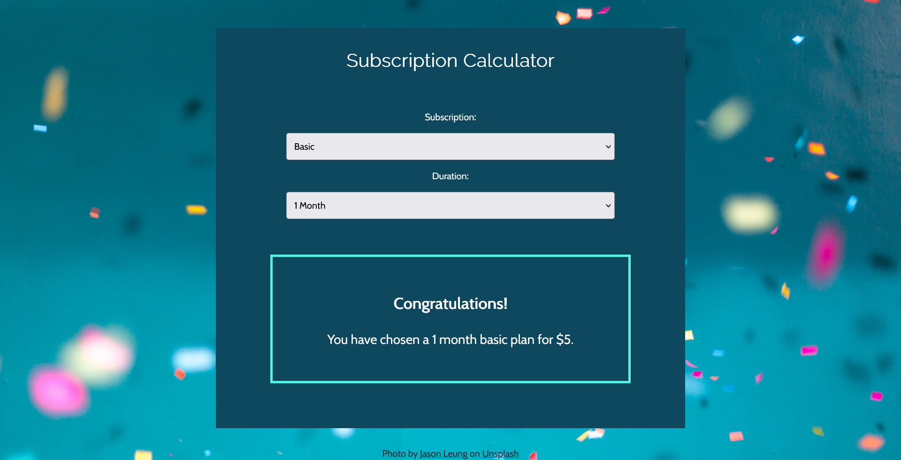

# Subscription calculator


## Table of contents

- [Overview](#overview)
  - [The challenge](#the-challenge)
  - [Screenshot](#screenshot)
  - [Links](#links)
- [My process](#my-process)
  - [Built with](#built-with)
  - [What I learned](#what-i-learned)
- [Author](#author)


## Overview

### The challenge

Users should be able to:

- View the optimal layout for the page depending on their device's screen size
- Choose a subscription plan from the given options
- See the total amount of money for one, three, or six months of subscription depending on the chosen option

### Screenshot




### Links

- Live Site URL: [Add live site URL here](https://your-live-site-url.com)

## My process

### Built with

- Semantic HTML5 markup
- Flexbox
- Mobile-first workflow
- Javascript


### What I learned

While working through this project I learned how to use the document.querySelector() and addEventListener() methods in order to create a subscription plan calculator

Here are some examples of how I used the document.querySelector and addEventListener() methods:

```js
var subDurationElement = document.querySelector("#months");

subDurationElement.addEventListener("change", function (e) {
  subDuration = Number(e.target.value);
  // console.log(subDuration);
  updateSubscriptionDiv();
});
```


## Author

- Website - [Doina](https://doileo.github.io/portfolio/)


